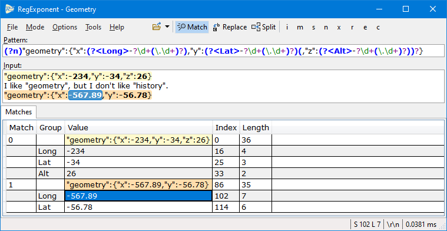
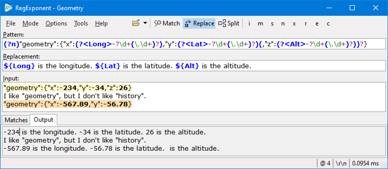
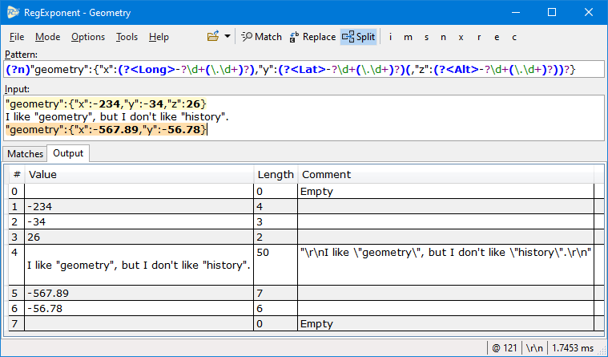

 

# RegExponent = RegX

> *[Regex](https://docs.microsoft.com/en-us/dotnet/api/system.text.regularexpressions.regex?view=net-6.0): .NET class for processing [regular expressions](https://docs.microsoft.com/en-us/dotnet/standard/base-types/regular-expressions).*
>
>*[Exponent](https://www.wordnik.com/words/exponent): noun. 1. One that expounds or interprets. 2. One that speaks for, represents, or advocates. 3. Some mathy stuff.*

RegExponent is a .NET regular expression tester for Windows written in WPF. It's inspired by a couple of other regex testers I've used over the years:

* [Regex Hero](http://regexhero.net/) - An old Silverlight app that supported desktop and web browser use.
* [Regex Storm](http://regexstorm.net/tester) - A modern browser-only tester.

I wanted a modern Windows app that had all the features I used from Regex Hero, and I wanted a UI more streamlined for how I work.

RegExponent uses the awesome, free [AvalonEdit](http://avalonedit.net/) WPF text editor for custom syntax highlighting of regex patterns, replacements, and input matches.

# Screenshots
## Match

## Replace

## Split

